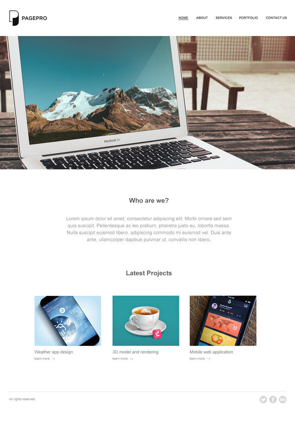

Front-end Test Project 01
=========================
Pagepro test project used for learning and recruitment.

## Project brief
Convert the following PSD (Photoshop) web design to HTML/CSS/JS.

## **[DEMO]**

[DEMO]: <http://htmlpreview.github.io/?https://github.com/marcint87/pagepro-front-end-test/blob/master/home.html>

## Requirements
1. Create project using the latest version of [HTML5Boilerplate](https://html5boilerplate.com/)
2. Use HTML5 / CSS
3. Create page called Home and place the elements on it

## Download PSD
[front-end-test-project-01.psd.zip](front-end-test-project-01.psd.zip?raw=true) (0.5MB)

## Supported browsers
Ensure that everything works and displays correctly in the following browsers:

- Firefox (latest version)
- Google Chrome (latest version)
- Microsoft Edge
- Internet Explorer 10

## Project Delivery
Create a public repo on your Github account and share the project URL with us once it’s done.
